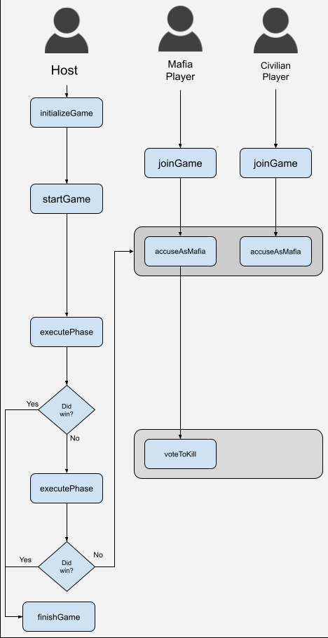

# Mafia Dapp

This project defines a contract that can be used to play games of Mafia on an EVM blockchain.

## Game Mechanics

Mafia is a game of social deception. Players are divided into two factions:

* **Civilians**: their objective is to identify and convict all Mafia members
* **Mafia**: their objective is to kill civilians

The Mafia know who is Mafia and Civilians, but the Civilians do not know which faction other players belong to. It is up to the Civilians to successfully cooperate together to find the Mafia members among them before it is too late.

Each round of the game is divided into two phases: a day phase and a night phase. During the day, all players submit votes to who they think is Mafia; whoever has the most votes is expelled from the game, having been convicted by popular vote. After this, the round transitions to night, where the Mafia players will work together to determine who they wish to kill.

Victory is achieved through the following conditions:

* *Mafia wins* if the number of civilians left after the day phase or night phase is less than or equal to the number of living, non-convicted Mafia members.
  * This is because, if there is an equal number of Mafia and Civilians, then the Mafia can, presumably, deadlock the Mafia accusations until they kill all of the remaining Civilians.
* *Civilians win* if all of the Mafia members have been successfully voted for and convicted of being Mafia.

### Game Rules

1. A minimum of three players is required.
2. Mafia players cannot kill other Mafia players.
3. Players who have been killed or convicted of being Mafia can no longer participating in the game.

## Smart Contract Function Flow

This diagram shows the flow of function calls in the contract needed to run a game of Mafia. Note that the host user defined here can also be a player - it's only separated out to illustrate the different roles (as a player can be both Mafia and host or Civilian and host).



## Development

To run the tests, execute:

```
npx hardhate test
```

You can get gas estimates with the tests by running:

```
REPORT_GAS=true npx hardhat test
```

To run the contract locally on a Hardhat node, create a local `.env` file and populate it as:

```
WALLET_KEY=<your dev wallet's private key>
```

Then un-comment the commented-out block in `hardhat.config.js` (as it, otherwise, interferes with running tests). After that, execute the following in one terminal:

```
npx hardhat node
```

...and then deploy the contract using:

```
npx hardhat run scripts/deploy.js
```